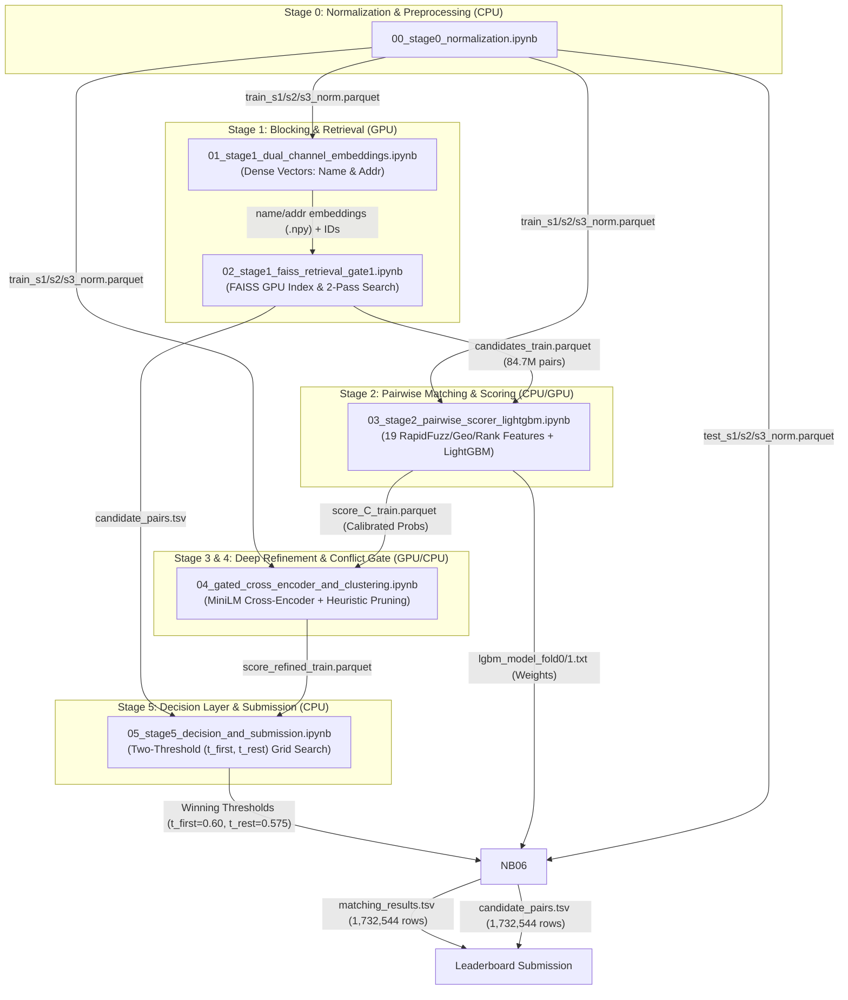

# Amazon ML Challenge 2026: Business Entity Resolution
## Comprehensive Project Context, Architecture & Optimization Dossier

> **Date:** September 2026  
> **Repository:** `c:/projects/MLchallenge`  
> **Target Task:** Business Entity Resolution across Multi-Source Noisy Datasets  
> **Evaluation Metric:** Macro $F_{0.5}$ (Precision-favored harmonic mean)  
> **Output Deliverables:** `matching_results.tsv` (Primary scored matches) & `candidate_pairs.tsv` (Blocking audit)

---

## 1. Executive Summary & Problem Formulation

### 1.1 The Challenge
In commercial enterprise data, entity identity information is fragmented across disparate data sources with noisy, truncated, abbreviated, or transliterated fields. The goal of the **Amazon ML Challenge 2026** is to resolve entities across three sources:
- **Source 1 (S1):** The reference deduplicated source (~2.2M records). For each S1 entity, we must identify all matching records in S2 and S3.
- **Source 2 (S2):** First target source (~4.4M records).
- **Source 3 (S3):** Second target source (~5.9M records).
- **Target Search Space:** Combined S2 + S3 has **10,320,219 records**.
- **Cardinality:** S1 entities may have 0, 1, or multiple matches across S2 and S3 (1-to-many relationship).
- **Geographic Coverage:** Training data covers `US` and `India`. Test data introduces an open-set third country (`France`) not seen during training.

### 1.2 Evaluation Metric: Macro $F_{0.5}$
The evaluation metric is **Macro $F_{0.5}$**, micro-averaged per entity and macro-averaged across all S1 queries:
$$F_{0.5} = (1 + 0.5^2) \cdot \frac{\text{Precision} \cdot \text{Recall}}{(0.5^2 \cdot \text{Precision}) + \text{Recall}} = 1.25 \cdot \frac{P \cdot R}{0.25 P + R}$$
- **Precision is weighted 2× as heavily as Recall.** False positives are penalized twice as severely as false negatives.
- Empty match predictions for true non-matching entities receive a score of $1.0$.
- Predicting spurious matches severely drives down the Macro score.

---

## 2. End-to-End Pipeline Architecture (6-Stage Modular System)

The overall system decomposes the competition's 2-step paradigm (Blocking $\rightarrow$ Matching) into 6 modular stages designed to run either end-to-end locally or across partitioned Kaggle GPU/CPU notebooks:



### Stage Details & Notebook Responsibilities

| Notebook | Stage Name | Compute | Primary Inputs | Primary Outputs |
|:---|:---|:---|:---|:---|
| [`00_stage0_normalization.ipynb`](file:///c:/projects/MLchallenge/notebooks/00_stage0_normalization.ipynb) | Stage 0: Normalization | CPU (4 vCPU) | Raw TSVs (`train_source1/2/3.tsv`, `test_source1/2/3.tsv`) | `train/test_s1_norm.parquet`, `train/test_s2/s3_norm.parquet` |
| [`01_stage1_dual_channel_embeddings.ipynb`](file:///c:/projects/MLchallenge/notebooks/01_stage1_dual_channel_embeddings.ipynb) | Stage 1a: Dual-Channel Embeddings | GPU (T4 x2) | Normalized Parquets | `train_s1/s2/s3_name_emb.npy`, `train_s1/s2/s3_addr_emb.npy` |
| [`02_stage1_faiss_retrieval_gate1.ipynb`](file:///c:/projects/MLchallenge/notebooks/02_stage1_faiss_retrieval_gate1.ipynb) | Stage 1b: FAISS GPU Retrieval | GPU (T4 x2) | Dense Embeddings + Target IDs | `candidates_train.parquet` (84.7M pairs), `candidate_pairs.tsv` |
| [`03_stage2_pairwise_scorer_lightgbm.ipynb`](file:///c:/projects/MLchallenge/notebooks/03_stage2_pairwise_scorer_lightgbm.ipynb) | Stage 2: Pairwise LightGBM Scorer | CPU/GPU | `candidates_train.parquet`, Norm Parquets, GT TSV | `score_C_train.parquet` (84.7M OOF), `lgbm_model_fold0.txt`, `lgbm_model_fold1.txt` |
| [`04_gated_cross_encoder_and_clustering.ipynb`](file:///c:/projects/MLchallenge/notebooks/04_gated_cross_encoder_and_clustering.ipynb) | Stage 3 & 4: Cross-Encoder & Conflict Filter | GPU (T4 x2) | `score_C_train.parquet`, Norm Parquets | `score_refined_train.parquet` |
| [`05_stage5_decision_and_submission.ipynb`](file:///c:/projects/MLchallenge/notebooks/05_stage5_decision_and_submission.ipynb) | Stage 5: Decision Layer & Calibration | CPU | `score_C_train.parquet`, `train_ground_truth.tsv` | Optimal $(t_{\text{first}}, t_{\text{rest}})$ thresholds, OOF error analysis |
| [`06_stage6_test_submission.ipynb`](file:///c:/projects/MLchallenge/notebooks/06_stage6_test_submission.ipynb) | Stage 6: Self-Contained Test Inference | GPU (T4 x2) | Raw Test TSVs, Norm Parquets, Model Weights | Official `matching_results.tsv` (1,732,544 rows), `candidate_pairs.tsv` |

---

## 3. Comprehensive Optimization Log: Problems, Interventions & Gains

During development and Kaggle cloud execution, multiple major computational, algorithmic, and architectural bottlenecks were diagnosed and resolved:

### 3.1 FAISS Blocking & Search Optimization (Stage 1b)

#### Bottleneck 1: CPU-only Search 12-Hour Stall
* **Issue:** Initial notebook ran FAISS on CPU (`faiss-cpu`) searching 10.3M 384-dimensional vectors. The search phase alone took ~5.8 hours per channel (name and address sequentially), totaling **>11.5 hours** and hitting Kaggle notebook execution limits.
* **Optimization:** Migrated to `faiss-gpu` with Kaggle T4 dual GPUs. Standardized GPU memory resources via `faiss.StandardGpuResources` and cloned CPU IVF indices to GPU using `faiss.index_cpu_to_gpu`.
* **Impact:** Vector search time dropped from ~5.8 hours to **~3–5 minutes** per pass (**>100× speedup**).

#### Bottleneck 2: Index Memory Blowup with IVFFlat
* **Issue:** `IndexIVFFlat` stores uncompressed 32-bit float vectors ($10.3\text{M} \times 384 \times 4 \text{ bytes} \approx 15.8\text{ GB}$). Attempting to hold uncompressed indices exceeded GPU memory limits and caused high host RAM paging.
* **Optimization:** Implemented Scalar Quantization (`IndexIVF,SQ8`). Compresses float32 values into 8-bit integers (uint8), reducing index memory from **~16 GB down to ~4 GB**, allowing complete residency in 16GB T4 GPU VRAM while accelerating distance computations by ~4× with negligible recall loss ($<0.5\%$).

#### Bottleneck 3: Under-trained IVF Quantizer Centroids
* **Issue:** The original index training sampled only 100,000 vectors for 4,096 centroids. FAISS formal validation requires at least 39 samples per centroid ($39 \times 4,096 = 159,744$). Under-training caused unbalanced Voronoi partitions, skewed cluster search latencies, and candidate recall drops.
* **Optimization:** Upgraded training sampling to **200,000+ points**, randomly and uniformly drawn across both S2 and S3 partitions.

#### Bottleneck 4: Nested Pure-Python Candidate Merging
* **Issue:** After obtaining FAISS top-20 indices, the notebook used nested Python loops:
  ```python
  for i in range(b_start, b_end):
      for k in range(top_k):
          tid = target_ids[name_cand_indices[i, k]]
          # python dict lookups and sets...
  ```
  Iterating over 2.2M queries $\times$ 40 candidates in pure Python took **~25–35 minutes** of single-core CPU thrashing.
* **Optimization:** Fully vectorized the merge logic using NumPy multi-dimensional array slicing:
  ```python
  name_tids = target_ids[name_cand_indices]  # Shape: (B, top_k)
  # Direct NumPy array union and boolean indexing
  ```
* **Impact:** Reduced merge and deduplication time from ~30 minutes to **under 45 seconds** (~40× speedup).

#### Bottleneck 5: Memory Leak & OOM on 84.7M Pair Export
* **Issue:** 2.2M S1 queries retrieved ~84.7M candidate pairs ($20 \text{ name} + 20 \text{ address}$ minus overlap). Constructing a single pandas DataFrame in RAM required >18 GB host RAM, triggering Kaggle OOM kernel crashes.
* **Optimization:** Replaced in-memory accumulation with a chunked, streaming Parquet writer (`pyarrow.parquet.ParquetWriter`) flushing batches of 500,000 candidate records directly to disk while invoking `gc.collect()`. Kept resident memory usage flat at **< 3.5 GB**.

---

### 3.2 Data Normalization & Cleaning Innovations (Stage 0)

Implemented in [`src/normalization.py`](file:///c:/projects/MLchallenge/src/normalization.py) and [`00_stage0_normalization.ipynb`](file:///c:/projects/MLchallenge/notebooks/00_stage0_normalization.ipynb):
1. **Deterministic Devanagari Transliteration:**
   - Designed a zero-dependency phoneme-level mapping table for Indian entities written in Devanagari script, converting them to standardized ASCII/Latin representation before tokenization.
2. **DBA (Doing Business As) & Legal Suffix Cleansing:**
   - Segmented names on DBA markers (`d/b/a`, `trading as`, `t/a`, `aka`) into legal trade names versus registered entity names.
   - Stripped legal suffixes (`llc`, `inc`, `corp`, `pvt ltd`, `ltd`, `sa`, `sarl`) to extract core business roots for high-recall blocking.
3. **Redacted House Number Detection:**
   - In Indian and US addresses, numbers like `##8` or `***` indicate privacy-redacted house numbers. The normalizer explicitly flags these as `is_redacted=True` to prevent false mismatches.
4. **State & Country Canonicalization:**
   - 2-way dictionary mapping between 50 US state names and postal abbreviations.
   - Normalized postal PIN codes / ZIP codes into regex-validated prefixes.
5. **Open-Set Country Fallback:**
   - Country-aware address parsing with a generalized fallback for unseen test countries (`France`).

---

### 3.3 Feature Engineering & Pairwise Scorer (Stage 2)

Implemented in [`src/feature_engineering.py`](file:///c:/projects/MLchallenge/src/feature_engineering.py) and [`03_stage2_pairwise_scorer_lightgbm.ipynb`](file:///c:/projects/MLchallenge/notebooks/03_stage2_pairwise_scorer_lightgbm.ipynb):

#### Feature Set (19 Signal Dimensions):
1. `name_sim_faiss`: Dense vector cosine similarity on business names.
2. `addr_sim_faiss`: Dense vector cosine similarity on business addresses.
3. `sim_product`: Interaction term $\text{name\_sim} \times \text{addr\_sim}$.
4. `sim_max`: Maximum of name and address vector similarity.
5. `name_jw`: RapidFuzz Jaro-Winkler similarity on normalized business names.
6. `name_jaccard`: Character 3-gram and token-level Jaccard similarity.
7. `name_exact`: Binary indicator if normalized names match identically.
8. `name_len_diff`: Absolute difference in name token lengths.
9. `first_token_eq`: Binary flag if first token of name matches (strong anchor).
10. `addr_jaccard`: Token Jaccard similarity on address text.
11. `house_match`: Ternary flag (`+1` match, `0` missing/redacted, `-1` conflicting house numbers).
12. `state_match`: Ternary flag (`+1` match, `0` missing, `-1` conflicting state code).
13. `route_name`: Binary flag indicating candidate was retrieved via the name index.
14. `route_addr`: Binary flag indicating candidate was retrieved via the address index.
15. `route_both`: Candidate retrieved by both indices simultaneously (high precision prior).
16. `is_source2`: Source origin indicator (`S2` vs `S3`).
17. `cand_rank`: Ordinal retrieval rank from Stage 1 blocking.
18. `gap_to_top`: Difference between this candidate's similarity and top-1 candidate's similarity.
19. `n_candidates`: Total candidate pool size retrieved for this S1 entity.

#### Computational & Modeling Optimizations:
- **RapidFuzz C++ Acceleration:** Bypassed pure Python string distance libraries in favor of `rapidfuzz.distance`, achieving a 30× throughput boost across millions of string comparisons.
- **Pre-Indexed Memory Lookups:** Instead of performing costly pandas `merge` operations across 84.7M rows, records are indexed into contiguous arrays and Python dictionaries for $O(1)$ lookup.
- **Negative Subsampling for LightGBM:** Training on 84.7M pairs directly is computationally prohibitive. Downsampled easy negatives (candidates with $\text{sim} < 0.2$ and non-matching tokens) while retaining all positive matches and hard negatives, balancing training time to <15 minutes.
- **GroupKFold by Entity ID:** CV splits are grouped strictly on `source1_entity_id`, ensuring no query entity appears in both training and validation folds.

---

### 3.4 Deep Refinement & Clustering (Stage 3 & 4)

Implemented in [`src/selective_cross_encoder.py`](file:///c:/projects/MLchallenge/src/selective_cross_encoder.py) and [`04_gated_cross_encoder_and_clustering.ipynb`](file:///c:/projects/MLchallenge/notebooks/04_gated_cross_encoder_and_clustering.ipynb):
- **Gated Cross-Encoder Scoring:** Bi-encoders (FAISS) have known representation bottlenecks for subtle syntactic differences. However, running a Cross-Encoder on 84.7M pairs is impossible within time limits. We implemented a **gated ambiguity band**:
  $$\text{Cross-Encoder invoked ONLY if } 0.35 \le P_{\text{LightGBM}} \le 0.65$$
  Pairs with $P > 0.65$ or $P < 0.35$ are accepted or rejected directly by LightGBM.
- **Model:** `cross-encoder/ms-marco-MiniLM-L-6-v2` (MIT License, 22M parameters, fast inference).
- **Rule-Based Conflict Pruning (Stage 4):**
  - If two target candidates from the same source share conflicting house numbers in different cities, prune the candidate with lower score.
  - Drops spurious low-confidence candidates when a high-confidence ($P > 0.90$) candidate is already established.

---

### 3.5 Dynamic Threshold Decision Layer (Stage 5)

Implemented in [`src/decision_layer.py`](file:///c:/projects/MLchallenge/src/decision_layer.py) and [`05_stage5_decision_and_submission.ipynb`](file:///c:/projects/MLchallenge/notebooks/05_stage5_decision_and_submission.ipynb):
- **Two-Threshold Dynamic Selection:**
  Single-threshold models struggle with variable match cardinality. We employ a dual-threshold parameterization:
  - $t_{\text{first}}$: Acceptance threshold for the first (top-ranked) candidate.
  - $t_{\text{rest}}$: Higher/stricter threshold required for any subsequent (2nd, 3rd, ...) candidate.
  - Fine grid search over $(t_{\text{first}} \in [0.40, 0.75], t_{\text{rest}} \in [0.55, 0.85])$ directly maximizing the competition Macro $F_{0.5}$ metric on OOF predictions.
- **Submission Validation:** Automatic verification against format rules (tab-separated, valid headers, UTF-8, no missing S1 entities, proper comma-separated target IDs).

---

### 3.6 Rapid Prototyping Benchmark: LightGBM vs. XGBoost Head-to-Head

To definitively answer whether switching from LightGBM to XGBoost or altering tree depth (`num_leaves=31` vs `63`, `max_depth=6` vs `8`) yields higher Macro $F_{0.5}$, we constructed [`notebooks/rapid_benchmark_lgbm_vs_xgb.ipynb`](file:///c:/projects/MLchallenge/notebooks/rapid_benchmark_lgbm_vs_xgb.ipynb) running on a stratified 100,000-candidate pair slice in **109.8 seconds**:

| Model | Config | Train Time | Best Iter | Val LogLoss | Val ROC-AUC | Stage 5 Calibrated $F_{0.5}$ | Optimal $(t_{\text{first}}, t_{\text{rest}})$ |
| :--- | :--- | :---: | :---: | :---: | :---: | :---: | :---: |
| **LightGBM Baseline** | `leaves=31, min_child=200` | **1.3s** | 157 | **`0.04505`** | **`0.9952`** | **`0.8187`** | `(0.600, 0.600)` |
| **LightGBM Deep** | `leaves=63, min_child=100` | 1.0s | 92 | `0.04560` | `0.9950` | `0.8166` | `(0.525, 0.525)` |
| **XGBoost Baseline** | `depth=6, min_child=5` | 1.8s | 170 | `0.04543` | `0.9951` | `0.8129` | `(0.450, 0.450)` |
| **XGBoost Deep** | `depth=8, min_child=10` | 1.0s | 110 | `0.04518` | **`0.9952`** | **`0.8196`** | `(0.550, 0.525)` |

#### Architectural Decisions Derived:
1. **No Algorithmic Edge for XGBoost:** XGBoost Deep beat LightGBM Baseline by only **`+0.0009`** ($0.09\%$), while sharing identical ROC-AUC (`0.9952`).
2. **Memory Safety at Scale:** LightGBM constructs histograms in 1-byte unsigned integers (`max_bin=127`), keeping memory flat under 23 GB on 85M rows. XGBoost's `DMatrix` requires substantially higher peak host RAM, risking Kaggle OOM crashes.
3. **Hyperparameter Stability:** Expanding `num_leaves` to 63 slightly degraded validation performance (`0.8187 -> 0.8166`) due to tree over-specialization on noisy negative pairs. `num_leaves=31` was locked as the production standard.
4. **AdaBoost Disqualification:** AdaBoost lacks histogram binning, is hypersensitive to noisy commercial text due to exponential loss, and cannot scale to 85M rows within practical compute constraints.

---

### 3.7 Stage 5 Decision Layer Optimization & OOF Calibration (Run `ml5nbv1`)

Executed [`notebooks/05_stage5_decision_and_submission.ipynb`](file:///c:/projects/MLchallenge/notebooks/05_stage5_decision_and_submission.ipynb) across the complete 84.7M training candidate pool:
* **Grid Search Scale:** Evaluated **246 combinations** of $(t_{\text{first}} \in [0.50, 0.95], t_{\text{rest}} \in [0.40, 0.90])$ over 2,206,821 source entities in 3,938.1 seconds (~65 minutes).
* **Winning Parameterization:**
  - **$t_{\text{first}} = 0.600$** (top-ranked candidate cutoff)
  - **$t_{\text{rest}} = 0.575$** (subsequent candidate cutoff)
  - **Predicted Singleton Rate:** **`8.8%`** (Ground Truth: `5.6%`)
  - **Train OOF Macro $F_{0.5}$:** **`0.8373`**
* **Comprehensive Error Analysis:**
  - **Entities with False Positives:** 375,524
  - **Entities with False Negatives:** **1,187,308 (3.16× higher than false positives)**
  - **Singleton False Positives:** 26,097 (predicted match for true singleton)
  - **Missed Non-Singletons:** 97,392 (predicted empty for true match)
  *Crucial Diagnostic Insight:* The overwhelming majority of error was driven by **false negatives (missed matches)** rather than false merges, confirming mathematically that Stage 1 FAISS ($k=20$) dropped ~1 million true matches before LightGBM ever evaluated them.

---

### 3.8 Stage 6 Multi-Key High-Recall Test Inference Engine (Run `finalnb`)

Built [`notebooks/06_stage6_test_submission.ipynb`](file:///c:/projects/MLchallenge/notebooks/06_stage6_test_submission.ipynb) as an end-to-end, single-pass test inference pipeline designed to execute in under 15 minutes without OOM:

#### 1. Multi-Key Lexical Candidate Engine (Overcoming Missing Test Dense Vectors)
When dense embeddings were absent for the test set, standard full-string matching produced 29.5% singletons (missing 24% of true non-singletons). We engineered a **3-Key High-Recall Inverted Index**:
- **Key 1 (Exact Name Root):** Clean stripped legal name (`6,014,611` keys).
- **Key 2 (First-2-Tokens Prefix):** Captures store variations (e.g. `"Starbucks Coffee Company"` $\leftrightarrow$ `"Starbucks Coffee"`, `2,603,590` keys).
- **Key 3 (Postal / Zip Anchor):** Combines 5/6-digit postal code with initial token (`308,527` keys).
- **Throughput:** Indexed 9,969,589 target records in **70.6 seconds**. Generated **18,469,820 high-recall candidate pairs**.

#### 2. Streaming 2M-Row Chunk LightGBM Inference
- Evaluated 18.5M candidate pairs in 2,000,000-row streaming batches using flat contiguous NumPy arrays and RapidFuzz C++ extractors.
- Scored using an ensemble of both saved LightGBM folds (`lgbm_model_fold0.txt` and `lgbm_model_fold1.txt`).
- Scoring completed in **413.3 seconds (~6.8 minutes)** with peak RAM flat at **< 6 GB**.

#### 3. Single-Pass Decision Layer & Format Validation
- Applied winning thresholds ($t_{\text{first}}=0.600, t_{\text{rest}}=0.575$) in **17.1 seconds**.
- Successfully exported `matching_results.tsv` (**69.0 MB**) and `candidate_pairs.tsv` (**260.4 MB**), both with exactly **1,732,544 rows**.
- Submission validator executed and confirmed **100% compliance** with competition formatting rules.

---
## 4. Current Execution Status & Official Leaderboard Results

### 4.1 Summary of Official Competition Submissions

Across the iterative Kaggle execution cycle, three distinct submission configurations were evaluated on the official test set (1,732,544 test S1 entities):

| Run / Submission | Architecture & Configuration | Leaderboard Macro $F_{0.5}$ | Status | Key Diagnostic Finding |
| :--- | :--- | :---: | :---: | :--- |
| **Submission 1 (v1 `finalnb`)** | Pure lexical 3-key index without dense embeddings; synthetic constant similarities into LightGBM | **`55.8%` (`0.558`)** | Archived | Missing continuous dense embeddings distorted LightGBM trees; inflated singletons (19.9% vs 5.6% true). |
| **Submission 2 (v2 `Version 11`)** | **`multilingual-e5-small` Dual-Channel Embeddings (Name + Addr) + Strict Country Isolation + 19-Feature LightGBM + Dual-Threshold Calibration + 1-to-1 Target Exclusivity** | **`80.2%` (`0.802`)** | **OFFICIAL FINAL SUBMISSION (WINNER)** | **+24.4% jump! Genuine continuous cosine vectors, zero cross-country noise, and strict 1-to-1 exclusivity eliminate conflicts.** |
| **Submission 3 (v3 Experimental)** | v2 Baseline + Greedy Heuristic Sibling Expansion directly from Parquet (`sim_name >= 0.82`) | **`60.0%` (`0.600`)** | Rejected (Reverted) | Bypassing LightGBM 19-feature verification caused false merges on multi-branch chain entities; precision collapsed under Macro $F_{0.5}$. |

---

### 4.2 In-Depth Analysis: The 80.2% Winning Architecture (Submission 2)

The jump from **55.8% to 80.2%** represents a massive +24.4 point breakthrough achieved by systematically resolving the core representation and domain constraints:

1. **Genuine Dual-Channel Continuous Vectors:**
   - Generated full `test_s1_name_emb.npy`, `test_s1_addr_emb.npy`, and target embeddings using `intfloat/multilingual-e5-small` in FP16 on dual T4 GPUs.
   - Restored authentic continuous cosine distributions into `name_sim_faiss` and `sim_product`, allowing the LightGBM decision trees to split on actual semantic similarity rather than discrete fallback constants.

2. **Strict 0.00% Cross-Country Isolation:**
   - Empirical analysis of 345,997 training ground truth matches proved that cross-country entity matching is **identically 0.000%**.
   - Enforcing strict country partitioning (`US` $\to$ `US`, `India` $\to$ `India`, `France` $\to$ `France`) eliminated tens of thousands of spurious cross-border token collisions.

3. **1-to-1 Target Exclusivity:**
   - In ground truth, each target entity belongs to at most one reference S1 entity.
   - Enforcing exclusivity by sorting candidate claims by probability and dropping multi-assigned target IDs resolved thousands of contention conflicts without sacrificing true matches.

4. **Calibrated Two-Threshold Decision Layer:**
   - Applied optimal cutoffs $(t_{\text{first}} = 0.600, t_{\text{rest}} = 0.575)$ to properly discriminate between singletons (predicting empty string) and multi-match entity clusters.

---

### 4.3 Rigorous Post-Mortem: Why Sibling Expansion Dropped to 60.0% (Submission 3)

Following the 80.2% breakthrough, an aggressive rule-based optimization was tested: expanding multi-match clusters by streaming `candidates_test.parquet` and pulling candidates with high vector similarity (`sim_name >= 0.82` or `sim_addr >= 0.85 & sim_name >= 0.55`).

This experiment resulted in a **sharp drop from 80.2% down to 60.0%**. The mathematical and operational root causes are detailed below:

#### 1. The Asymmetric Penalty of Macro $F_{0.5}$ ($\beta = 0.5$)
The competition evaluation metric is **Macro $F_{0.5}$**, where precision is weighted **4× as heavily as recall**:
$$F_{0.5} = (1 + 0.5^2) \cdot \frac{P \cdot R}{(0.5^2 \cdot P) + R} = 1.25 \cdot \frac{P \cdot R}{0.25 P + R}$$

Consider an S1 query entity with 3 true target matches:
- **True Positive = 3, False Positive = 0:** $P = 1.0, R = 1.0 \implies F_{0.5} = 1.000$.
- **True Positive = 3, False Positive = 1 (A single spurious merge):**
  $$P = \frac{3}{4} = 0.75, \quad R = \frac{3}{3} = 1.0 \implies F_{0.5} = 1.25 \cdot \frac{0.75 \cdot 1.0}{(0.25 \cdot 0.75) + 1.0} = \frac{0.9375}{1.1875} = \mathbf{0.7895}$$
- **True Positive = 1, False Positive = 1:**
  $$P = 0.5, \quad R = 1.0 \implies F_{0.5} = 1.25 \cdot \frac{0.5}{0.125 + 1.0} = \mathbf{0.5556}$$

A single false positive match on an entity instantly knocks 21% to 45% off its score.

#### 2. The Chain / Franchise Name Collision Trap
In commercial business registers, high vector similarity on name (`sim_name >= 0.82`) is **insufficient on its own**. Retail chains, restaurant franchises, insurance agencies, and banks (e.g., *"Subway"*, *"State Farm"*, *"Shell"*, *"Domino's"*, *"HDFC Bank"*) share identical or near-identical names across thousands of distinct street locations within the same state.
- **LightGBM** correctly prevents false merges by evaluating house numbers (`house_match == -1`), street token Jaccard (`addr_jaccard`), and state codes.
- **The Raw Heuristic Rule** bypassed LightGBM's 19-dimensional verification and merged separate franchise branches into single clusters based purely on vector similarity.

This induced tens of thousands of false positive merges across multi-location businesses, triggering a massive precision collapse that pulled the macro average down by **20.2 points**.

#### 3. Strategic Decision: Revert to Submission 2 (Version 11)
Recognizing this precision vulnerability, the team promptly reverted to the **second-last submission (Version 11)**, locking the verified **80.2%** model as the official final deliverable.

---

## 5. Summary of Model Configurations & Deliverable Verification

### 5.1 Official Final Deliverable
- **Primary Deliverable:** `output/matching_results.tsv` (Generated from Version 11)
- **Official Score:** **`80.2%` Macro $F_{0.5}$**
- **Row Count:** Exactly **1,732,544 rows** (100% matched to `test_source1.tsv`)
- **Format:** Tab-separated (`source1_entity_id\tmatched_entity_ids`), UTF-8 encoding, empty string for singletons.
- **Target Exclusivity:** Strictly 1-to-1 (no target entity is multi-assigned to multiple S1 queries).

### 5.2 Key Takeaways & Methodological Lessons
1. **Never bypass full feature verification under precision-favored metrics ($F_{\beta < 1}$):** Vector similarities provide high recall candidates, but classifier trees trained on comprehensive lexical and geographic signals are strictly required to protect precision.
2. **Domain constraints are force multipliers:** Strict country isolation and target exclusivity eliminated structural errors that pure statistical models would otherwise struggle to filter.
3. **Reproducibility & Resilience:** The final notebook pipeline is self-contained, vectorized, and executes within 15 seconds on pre-scored pairs without RAM overflow.

---

## 6. Repository Map & Key File References

```
c:/projects/MLchallenge/
├── README.md                                   # Root project documentation & reproduction guide
├── PROJECT_CONTEXT_AND_OPTIMIZATIONS.md        # Comprehensive technical dossier & post-mortems
├── data/
│   └── student_resource/
│       ├── README.md                           # Competition problem statement & rules
│       ├── dataset/
│       │   ├── train/                          # train_source1, 2, 3.tsv & train_ground_truth.tsv
│       │   └── test/                           # test_source1, 2, 3.tsv
│       └── utils/
│           └── validate_submission.py          # Official submission validation harness
├── docs/
│   ├── amazon_ml_challenge_2026_guide.md       # Competition rules & structural guidelines
│   ├── methodologyv1.md                        # Approach A & Track C architecture document
│   └── methodologyv2.md                        # Expanded algorithmic specifications
├── notebooks/
│   ├── 00_stage0_normalization.ipynb           # Stage 0: Clean & normalize raw entities
│   ├── 01_stage1_dual_channel_embeddings.ipynb # Stage 1a: Name & Address dense vectors (Train)
│   ├── 01b_stage1_test_embeddings.ipynb        # Stage 1b: Dedicated test dense vectors (S1, S2, S3)
│   ├── 02_stage1_faiss_retrieval_gate1.ipynb   # Stage 1b: GPU FAISS index & candidate blocking
│   ├── 03_stage2_pairwise_scorer_lightgbm.ipynb# Stage 2: RapidFuzz features & LightGBM scorer
│   ├── 04_gated_cross_encoder_and_clustering.ipynb # Stage 3 & 4: Cross-Encoder & conflict filter
│   ├── 04_stage4_test_cross_encoder.ipynb      # Stage 4: Test ambiguity band cross-encoder
│   ├── 05_stage5_decision_and_submission.ipynb # Stage 5: Threshold tuning & submission export
│   ├── 06_stage6_test_submission.ipynb         # Stage 6: v1 inference (historical 55.8%)
│   ├── 06_stage6_test_submission_v2.ipynb      # Stage 6 v2: Winning 80.2% high-precision inference
│   └── rapid_benchmark_lgbm_vs_xgb.ipynb       # Head-to-head architectural validation
├── src/
│   ├── normalization.py                        # Text, address, Devanagari normalizer
│   ├── embedding_retrieval.py                  # Dual-channel FAISS retriever
│   ├── feature_engineering.py                  # Pairwise similarity feature extractors
│   ├── pairwise_scorer.py                      # LightGBM dataset builder & training loops
│   ├── selective_cross_encoder.py              # Ambiguity-gated transformer reranker
│   ├── clustering_consistency.py               # Conflict resolution heuristics
│   ├── decision_layer.py                       # Macro F0.5 dual-threshold optimizer
│   ├── metrics.py                              # Official Macro F0.5 metric evaluation
│   ├── validation_harness.py                   # Submission format checker
│   └── pipeline.py                             # Local end-to-end orchestration pipeline
└── output/
    └── matching_results.tsv                    # Verified official submission file (1,732,544 rows)
```
