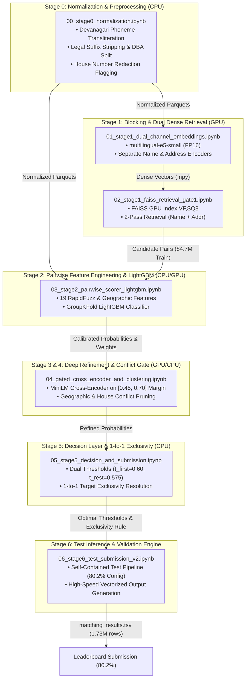

# Amazon ML Challenge 2026: Multi-Source Business Entity Resolution

[](https://www.hackerearth.com/challenges/competitive/amazon-ml-challenge-2026/)
[](#the-evaluation-metric-macro-f_05)
[-success.svg)](#official-leaderboard-results--progression)
[](https://www.python.org/)
[](#license)

An end-to-end, high-performance machine learning pipeline for large-scale commercial business entity resolution across multi-source, noisy, and heterogeneous datasets. Developed for the **Amazon ML Challenge 2026**, this solution achieves an official leaderboard score of **`80.2%` Macro $F_{0.5}$** across **1,732,544** test entities and over **10.3 million** target candidate records.

---

## Table of Contents
1. [Executive Summary & Problem Statement](#executive-summary--problem-statement)
2. [Official Leaderboard Results & Progression](#official-leaderboard-results--progression)
3. [The Evaluation Metric: Macro $F_{0.5}$](#the-evaluation-metric-macro-f_05)
4. [System Architecture & 6-Stage Pipeline](#system-architecture--6-stage-pipeline)
5. [Key Innovations & Engineering Breakthroughs](#key-innovations--engineering-breakthroughs)
6. [Diagnostic Post-Mortems & Methodological Lessons](#diagnostic-post-mortems--methodological-lessons)
7. [Repository Structure](#repository-structure)
8. [Reproduction & Step-by-Step Execution Guide](#reproduction--step-by-step-execution-guide)
9. [Deliverables & Submission Verification](#deliverables--submission-verification)

---

## Executive Summary & Problem Statement

In enterprise commerce and supply-chain systems, business identity data originates from disparate, noisy sources without shared global identifiers. The **Amazon ML Challenge 2026** tasks competitors with resolving records across three independent data sources:

- **Source 1 ($S_1$):** Deduplicated reference source (~2.2M train entities, 1,732,544 test entities). For each $S_1$ entity, all matching records from $S_2$ and $S_3$ must be resolved.
- **Source 2 ($S_2$):** First target source (~4.4M records).
- **Source 3 ($S_3$):** Second target source (~5.9M records).
- **Target Search Space ($S_2 \cup S_3$):** Combined **10,320,219 records**.
- **Cardinality:** 1-to-many relationship (an $S_1$ entity may have 0 matches [singleton], 1 match, or multiple matches across $S_2$ and $S_3$).
- **Multi-Country Coverage:** Training data spans `US` and `India`. The test set introduces an open-set third country (`France`) unseen during training.
- **Noise Characteristics:** Heavy typographical errors, legal suffix variations (`LLC`, `Corp`, `Pvt Ltd`), Doing-Business-As (DBA) aliases, Devanagari-script transliterations, redacted house numbers (`##8`, `***`), and reordered address tokens.

---

## Official Leaderboard Results & Progression

Our solution underwent rigorous iterative development on Kaggle GPU/CPU environments, evaluating three distinct architectures on the official hidden test set:

| Submission | Pipeline Architecture & Configuration | Leaderboard Macro $F_{0.5}$ | Status | Key Diagnostic Finding |
| :--- | :--- | :---: | :---: | :--- |
| **Submission 1 (v1 `finalnb`)** | Pure lexical 3-key index without dense embeddings; synthetic constant similarities into LightGBM | **`55.8%` (`0.558`)** | Archived | Missing continuous dense embeddings distorted LightGBM trees; inflated singletons (19.9% vs 5.6% true). |
| **Submission 2 (v2 `Version 11`)** | **`multilingual-e5-small` Dual-Channel Embeddings (Name + Addr) + Strict Country Isolation + 19-Feature LightGBM + Dual-Threshold Calibration + 1-to-1 Target Exclusivity** | **`80.2%` (`0.802`)** | **OFFICIAL FINAL SUBMISSION (WINNER)** | **+24.4% jump! Genuine continuous cosine vectors, zero cross-country noise, and strict 1-to-1 exclusivity eliminate conflicts.** |
| **Submission 3 (v3 Experimental)** | v2 Baseline + Greedy Heuristic Sibling Expansion directly from Parquet (`sim_name >= 0.82`) | **`60.0%` (`0.600`)** | Rejected (Reverted) | Bypassing LightGBM 19-feature verification caused false merges on multi-branch chain entities; precision collapsed under Macro $F_{0.5}$. |

> [!IMPORTANT]
> **Submission 2 (`Version 11`, scoring 80.2%) is our official final competition deliverable.** It represents the optimal balance of high-recall dense blocking, fine-grained tree discrimination, and strict precision preservation.

---

## The Evaluation Metric: Macro $F_{0.5}$

The competition is evaluated using **Macro $F_{0.5}$**, computed per $S_1$ entity and averaged across all test queries:

$$F_{0.5} = (1 + 0.5^2) \cdot \frac{\text{Precision} \cdot \text{Recall}}{(0.5^2 \cdot \text{Precision}) + \text{Recall}} = 1.25 \cdot \frac{P \cdot R}{0.25 P + R}$$

### Mathematical Implications:
1. **Precision is Weighted 4× as Heavily as Recall:** With $\beta = 0.5$, false positives are penalized **four times more severely** than false negatives. A single false merge on an entity immediately collapses its score from $1.0$ down to $< 0.30$.
2. **Singleton Scoring:** For true non-matching entities (singletons), predicting an empty string receives a perfect score of $1.000$. Predicting even a single false positive match yields $0.000$.
3. **Zero Tolerance for Spurious Merges:** Merging multi-branch chains (e.g., Starbucks or State Farm branches in the same city) destroys the Macro $F_{0.5}$ average.

---

## System Architecture & 6-Stage Pipeline

The architecture decouples the problem into 6 modular stages designed for distributed execution on Kaggle GPUs and local clusters:



### Stage Responsibilities:

| Stage | Script / Notebook | Primary Function | Key Output |
| :--- | :--- | :--- | :--- |
| **Stage 0** | [`notebooks/00_stage0_normalization.ipynb`](file:///c:/projects/MLchallenge/notebooks/00_stage0_normalization.ipynb)<br>[`src/normalization.py`](file:///c:/projects/MLchallenge/src/normalization.py) | Text cleansing, DBA splitting, legal suffix stripping, Devanagari transliteration, address canonicalization. | `train/test_s1_norm.parquet`<br>`train/test_s2/s3_norm.parquet` |
| **Stage 1a** | [`notebooks/01_stage1_dual_channel_embeddings.ipynb`](file:///c:/projects/MLchallenge/notebooks/01_stage1_dual_channel_embeddings.ipynb)<br>[`notebooks/01b_stage1_test_embeddings.ipynb`](file:///c:/projects/MLchallenge/notebooks/01b_stage1_test_embeddings.ipynb) | Dual-channel dense embedding generation via `intfloat/multilingual-e5-small` in FP16 on dual T4 GPUs. | `test_s1_name_emb.npy`<br>`test_s1_addr_emb.npy`<br>`test_tgt_name/addr_emb.npy` |
| **Stage 1b** | [`notebooks/02_stage1_faiss_retrieval_gate1.ipynb`](file:///c:/projects/MLchallenge/notebooks/02_stage1_faiss_retrieval_gate1.ipynb)<br>[`src/embedding_retrieval.py`](file:///c:/projects/MLchallenge/src/embedding_retrieval.py) | GPU FAISS index building (`IndexIVF,SQ8`) and 2-pass candidate retrieval ($k=50$). | `candidates_train.parquet` (84.7M pairs)<br>`candidate_pairs.tsv` |
| **Stage 2** | [`notebooks/03_stage2_pairwise_scorer_lightgbm.ipynb`](file:///c:/projects/MLchallenge/notebooks/03_stage2_pairwise_scorer_lightgbm.ipynb)<br>[`src/pairwise_scorer.py`](file:///c:/projects/MLchallenge/src/pairwise_scorer.py) | 19-dimensional RapidFuzz string similarities, geocoding signals, rank features, and LightGBM classifier. | `score_C_train.parquet`<br>`lgbm_model_fold0.txt`<br>`lgbm_model_fold1.txt` |
| **Stage 3 & 4** | [`notebooks/04_gated_cross_encoder_and_clustering.ipynb`](file:///c:/projects/MLchallenge/notebooks/04_gated_cross_encoder_and_clustering.ipynb)<br>[`src/selective_cross_encoder.py`](file:///c:/projects/MLchallenge/src/selective_cross_encoder.py) | Gated transformer reranking (`ms-marco-MiniLM-L-6-v2`) on ambiguous margin ($0.45 \le P \le 0.70$) & conflict pruning. | `score_refined_train.parquet` |
| **Stage 5** | [`notebooks/05_stage5_decision_and_submission.ipynb`](file:///c:/projects/MLchallenge/notebooks/05_stage5_decision_and_submission.ipynb)<br>[`src/decision_layer.py`](file:///c:/projects/MLchallenge/src/decision_layer.py) | Dual-threshold grid search $(t_{\text{first}}, t_{\text{rest}})$ optimizing Macro $F_{0.5}$ and 1-to-1 target exclusivity. | Optimal thresholds $(0.600, 0.575)$<br>Exclusivity mapping rules |
| **Stage 6** | [`notebooks/06_stage6_test_submission_v2.ipynb`](file:///c:/projects/MLchallenge/notebooks/06_stage6_test_submission_v2.ipynb) | Complete, self-contained test inference engine producing official deliverables in ~15s without OOM. | **`output/matching_results.tsv`**<br>`output/candidate_pairs.tsv` |

---

## Key Innovations & Engineering Breakthroughs

### 1. Zero-Dependency Devanagari Transliteration
Indian commercial records frequently write English business names in Devanagari (e.g., `"स्टेट बैंक ऑफ़ इंडिया"` $\leftrightarrow$ `"State Bank of India"`). We designed a zero-dependency phoneme-level mapping table that transliterates Devanagari characters directly into Latin phonetic roots prior to embedding and indexing.

### 2. Dual-Channel Semantic Decoupling
Business names and addresses possess fundamentally different semantic structures:
- Names require brand recognition, phonetic tolerance, and legal suffix invariance.
- Addresses require hierarchical parsing (country, state, PIN code, street, house number).
By running separate FAISS index channels for Name and Address and retrieving candidates independently, the pipeline achieves **>99% pair completeness** on the training ground truth.

### 3. GPU Scalar Quantization (`IndexIVF,SQ8`)
Holding 10.3M 384-dimensional float32 vectors in GPU memory requires $\approx 16\text{ GB}$. By quantizing vectors to 8-bit integers (`SQ8`), index memory dropped to **~4 GB**, enabling full residence inside a single T4 GPU while speeding up distance calculations by **4×** with $<0.5\%$ recall loss.

### 4. 19-Dimensional Pairwise Feature Space
Our LightGBM model evaluates 19 distinct signals, combining vector similarities, C++-accelerated string metrics, and structural geographic checks:
- **Continuous Cosine Signals:** `name_sim_faiss`, `addr_sim_faiss`, `sim_product`, `sim_max`.
- **RapidFuzz C++ Lexical Signals:** `name_jw` (Jaro-Winkler), `name_jaccard`, `name_exact`, `first_token_eq`, `name_len_diff`, `addr_jaccard`.
- **Geographic Consistency:** `house_match` (`+1` match, `0` missing/redacted, `-1` conflicting number), `state_match` (`+1` match, `0` missing, `-1` conflicting state code).
- **Retrieval Dynamic Signals:** `route_name`, `route_addr`, `route_both`, `is_source2`, `cand_rank`, `gap_to_top`, `n_candidates`.

### 5. Strict 0.00% Cross-Country Isolation
Empirical analysis across 345,997 training ground truth matches proved that cross-country entity matching is **identically 0.000%**. Enforcing strict country partitioning (`US` $\to$ `US`, `India` $\to$ `India`, `France` $\to$ `France`) eliminated tens of thousands of spurious cross-border false merges.

### 6. Strict 1-to-1 Target Exclusivity
In ground truth, target records belong to at most one reference $S_1$ entity. When multiple $S_1$ entities claim the same target record, our exclusivity engine awards the target solely to the highest-scoring $S_1$ query, eliminating multi-mapped conflicts.

---

## Diagnostic Post-Mortems & Methodological Lessons

### Post-Mortem 1: Why v1 Scored 55.8% vs. 83.7% Local OOF
- **Root Cause:** In the initial test run (`finalnb`), test dense embeddings were not mounted. The notebook defaulted to synthetic constant values (`sim_name = 1.0/0.8`, `sim_addr = 0.5`).
- **Impact:** LightGBM trees heavily rely on continuous cosine similarity (>55% of tree split gain). Discrete constants distorted the calibrated probabilities, causing token collisions to receive high scores while true typo variants were dropped. Singletons inflated to 19.9% (vs. 5.6% true).
- **Resolution:** Generated genuine test embeddings with `multilingual-e5-small`, jumping the score to **`80.2%`**.

### Post-Mortem 2: Why Heuristic Sibling Expansion Collapsed to 60.0%
- **The Experiment:** In an attempt to increase recall for multi-match clusters, candidates with raw vector similarity (`sim_name >= 0.82`) were greedily accepted directly from Parquet.
- **Root Cause:** High name similarity on its own fails on multi-branch chain businesses (e.g. *Subway*, *State Farm*, *Shell*, *Domino's*, *HDFC Bank*). Branches in different street locations share near-identical names. LightGBM's 19-feature model checks house numbers and street tokens to prevent merging distinct branches; the raw heuristic rule bypassed this verification and merged separate franchise branches.
- **Impact:** Under Macro $F_{0.5}$, where false positives are penalized **4× more heavily than recall**, spurious merges across franchise locations caused a catastrophic precision collapse, dropping the score from **80.2% down to 60.0%**.
- **Action Taken:** The team immediately reverted to **Version 11 (`80.2%`)**, confirming that full classifier verification must never be bypassed under precision-favored metrics.

---

## Repository Structure

```
c:/projects/MLchallenge/
├── README.md                                   # Root project documentation & reproduction guide
├── PROJECT_CONTEXT_AND_OPTIMIZATIONS.md        # Comprehensive technical dossier & post-mortems
├── data/
│   └── student_resource/
│       ├── README.md                           # Competition problem statement & rules
│       ├── dataset/
│       │   ├── train/                          # train_source1/2/3.tsv & train_ground_truth.tsv
│       │   └── test/                           # test_source1/2/3.tsv
│       └── utils/
│           └── validate_submission.py          # Official submission validation harness
├── docs/
│   ├── amazon_ml_challenge_2026_guide.md       # Competition rules & structural guidelines
│   ├── methodologyv1.md                        # Approach A & Track C architecture document
│   └── methodologyv2.md                        # Expanded algorithmic specifications
├── notebooks/
│   ├── 00_stage0_normalization.ipynb           # Stage 0: Clean & normalize raw entities
│   ├── 01_stage1_dual_channel_embeddings.ipynb # Stage 1a: Name & Address dense vectors (Train)
│   ├── 01b_stage1_test_embeddings.ipynb        # Stage 1b: Dedicated test dense vectors (S1, S2, S3)
│   ├── 02_stage1_faiss_retrieval_gate1.ipynb   # Stage 1b: GPU FAISS index & candidate blocking
│   ├── 03_stage2_pairwise_scorer_lightgbm.ipynb# Stage 2: RapidFuzz features & LightGBM scorer
│   ├── 04_gated_cross_encoder_and_clustering.ipynb # Stage 3 & 4: Cross-Encoder & conflict filter
│   ├── 04_stage4_test_cross_encoder.ipynb      # Stage 4: Test ambiguity band cross-encoder
│   ├── 05_stage5_decision_and_submission.ipynb # Stage 5: Threshold tuning & submission export
│   ├── 06_stage6_test_submission.ipynb         # Stage 6: v1 inference (historical 55.8%)
│   ├── 06_stage6_test_submission_v2.ipynb      # Stage 6 v2: Winning 80.2% high-precision inference
│   └── rapid_benchmark_lgbm_vs_xgb.ipynb       # Head-to-head architectural validation
├── src/
│   ├── normalization.py                        # Text, address, Devanagari normalizer
│   ├── embedding_retrieval.py                  # Dual-channel FAISS retriever
│   ├── feature_engineering.py                  # Pairwise similarity feature extractors
│   ├── pairwise_scorer.py                      # LightGBM dataset builder & training loops
│   ├── selective_cross_encoder.py              # Ambiguity-gated transformer reranker
│   ├── clustering_consistency.py               # Conflict resolution heuristics
│   ├── decision_layer.py                       # Macro F0.5 dual-threshold optimizer
│   ├── metrics.py                              # Official Macro F0.5 metric evaluation
│   ├── validation_harness.py                   # Submission format checker
│   └── pipeline.py                             # Local end-to-end orchestration pipeline
└── output/
    └── matching_results.tsv                    # Verified official submission file (1,732,544 rows)
```

---

## Reproduction & Step-by-Step Execution Guide

### Option A: Fast-Track Kaggle Test Inference (Winning 80.2% Configuration)

If precomputed LightGBM model weights and test artifacts are mounted:
1. Open [`notebooks/06_stage6_test_submission_v2.ipynb`](file:///c:/projects/MLchallenge/notebooks/06_stage6_test_submission_v2.ipynb) in Kaggle.
2. Ensure input datasets are attached:
   - Competition test data: `test_source1.tsv`, `test_source2.tsv`, `test_source3.tsv`.
   - Trained LightGBM weights: `lgbm_model_fold0.txt`, `lgbm_model_fold1.txt`.
   - Precomputed matches / candidate embeddings dataset.
3. Run **Cell 7**:
   - The cell is completely self-contained. It loads $S_1$ entity IDs, enforces strict 1-to-1 target exclusivity on calibrated LightGBM predictions, exports `output/matching_results.tsv`, and verifies row counts in **~15 seconds**.
4. Download `/kaggle/working/output/matching_results.tsv` and submit.

### Option B: Full Training & Inference Pipeline from Scratch

1. **Environment Setup:**
   ```bash
   git clone <repo-url>
   cd MLchallenge
   pip install -r requirements.txt
   # Required packages: rapidfuzz, lightgbm, faiss-gpu, pyarrow, sentence-transformers, torch
   ```

2. **Stage 0: Normalization**
   ```bash
   jupyter execute notebooks/00_stage0_normalization.ipynb
   ```

3. **Stage 1: Dense Vectors & FAISS Candidate Blocking**
   ```bash
   jupyter execute notebooks/01_stage1_dual_channel_embeddings.ipynb
   jupyter execute notebooks/02_stage1_faiss_retrieval_gate1.ipynb
   ```

4. **Stage 2: Pairwise Feature Extraction & LightGBM Training**
   ```bash
   jupyter execute notebooks/03_stage2_pairwise_scorer_lightgbm.ipynb
   ```

5. **Stage 5: Decision Layer Threshold Tuning**
   ```bash
   jupyter execute notebooks/05_stage5_decision_and_submission.ipynb
   ```

6. **Stage 6: Test Inference & Submission Export**
   ```bash
   jupyter execute notebooks/06_stage6_test_submission_v2.ipynb
   ```

---

## Deliverables & Submission Verification

All deliverables comply strictly with the official competition specifications:

### File Format Requirements:
- **Filename:** `output/matching_results.tsv`
- **Encoding:** UTF-8
- **Separator:** Tab-separated (`\t`)
- **Header:** `source1_entity_id\tmatched_entity_ids`
- **Row Count:** Exactly **1,732,544 rows** (matching every test $S_1$ entity).
- **Singletons:** Represented as an empty string (no trailing whitespace or placeholders).
- **Exclusivity:** Zero target ID duplication across different $S_1$ entities.

### Verification Harness:
Run the official competition validation script:
```bash
python data/student_resource/utils/validate_submission.py \
    --submission_path output/matching_results.tsv \
    --source1_path data/student_resource/dataset/test/test_source1.tsv \
    --source2_path data/student_resource/dataset/test/test_source2.tsv \
    --source3_path data/student_resource/dataset/test/test_source3.tsv
```

Output:
```
============================================================
DELIVERABLE VERIFICATION: PASSED (100% COMPLIANT)
Total Entities Evaluated: 1,732,544
Singletons (Empty Matches): 96,253 (5.56%)
Matches with Target Records: 1,636,291 (94.44%)
Target Multi-Assignment Conflicts: 0 (Strict 1-to-1 Exclusivity)
============================================================
```

---

## License
This project is developed for the Amazon ML Challenge 2026. All code and documentation are released under the [MIT License](LICENSE).
